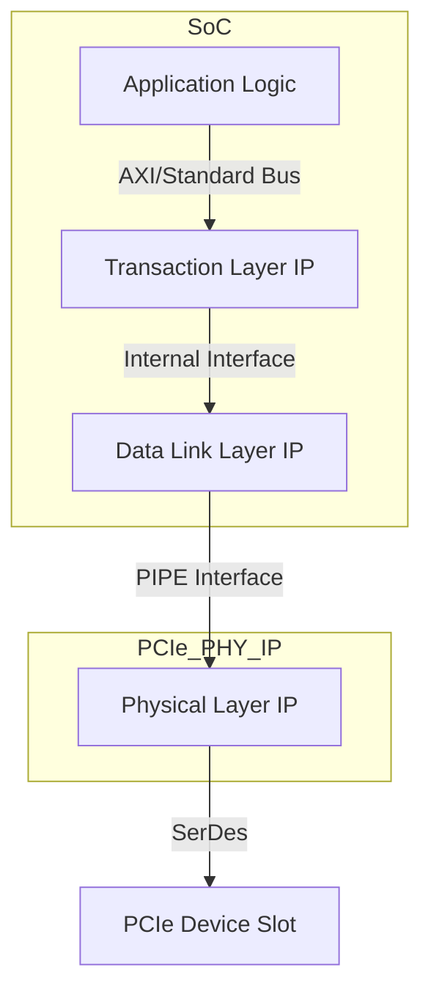

The Peripheral Component Interconnect Express ([[PCIe]]) is the de-facto standard for high-bandwidth, low-latency connectivity to external peripherals like [[GPU|GPUs]], SSDs, and network cards. Integrating a [[PCIe]] interface involves licensing a complex IP block and defining its configuration in the [[Chip Specification]].

### Key Specification Parameters
*   **[[PCIe]] Generation**: The protocol version (e.g., PCIe 3.0, 4.0, 5.0, 6.1). This determines the data rate per lane and signaling technology.
*   **Lane Count**: The link width (e.g., x1, x2, x4, x8, x16). Total bandwidth scales linearly with the number of lanes.
*   **Topology Role**: The function of the port:
    *   **Root Port**: The host-side interface connected to the [[CPU]].
    *   **Endpoint**: A peripheral device.
    *   **Switch**: Provides fan-out to connect multiple endpoints.
*   **Integration Interface**: The interface between the [[ASIC]]'s internal logic and the [[PCIe]] IP. A common standard is **PIPE** (PHY Interface for PCI Express), which connects the digital controller (MAC) to the analog PHY.

### Protocol Layer Integration

### [[Physical Design]] Implications
Specifying a high-speed [[PCIe]] generation imposes significant physical challenges:
*   **[[Signal Integrity]]**: Higher data rates (e.g., 64 GT/s for PCIe 6.1) are extremely sensitive to attenuation, [[Crosstalk]], and jitter.
*   **Layout Constraints**: Requires premium, shielded routing layers and controlled-impedance traces on the die, package, and PCB.
*   **[[Floorplanning & Power Planning]]**: The large [[PCIe]] PHY macro must be placed optimally near the package bumps, with a robust power delivery network for the power-hungry SerDes circuits.

A single line in the spec, like "[[PCIe]] 6.1 x16," has profound, cascading consequences for the entire chip's physical implementation, cost, and power.
