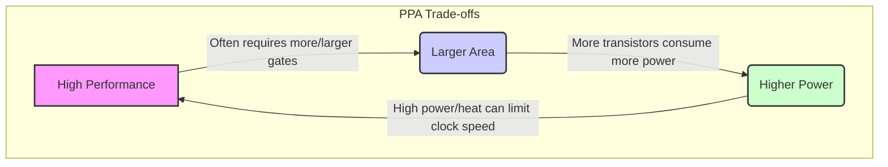

[[PPA]] represents the "magic triangle" of [[ASIC Design Flow|ASIC design]]—three critical, competing metrics that govern nearly every architectural and implementation decision. The [[Chip Specification]] must define explicit, quantifiable targets for each, and prioritize them based on the target application.

### The Three Metrics
1.  **Performance**: Measures how fast the [[chip]] operates.
    *   **Metrics**: [[Clock Frequency]] (e.g., 1.5 GHz), application throughput (e.g., 60 4K frames/sec), or latency.
2.  **Power**: Defines the energy consumption budget.
    *   **Dynamic Power**: Consumed when transistors switch. A function of frequency, voltage, and activity.
    *   **Static Power**: Consumed due to leakage currents, even when idle. A major concern in advanced process nodes.
3.  **Area**: The physical silicon space the design occupies, measured in mm².
    *   Area is a primary driver of [[Cost Target|manufacturing cost]]. A smaller [[Die Size Estimation|die size]] means more chips per wafer and higher manufacturing [[Yield Analysis|yield]].

### The Trade-off
Improving one metric often comes at the expense of the others. The [[Microarchitecture]] must find the optimal balance for the end product.
*   **High Performance** often requires deeper pipelines, parallel execution units, and larger caches, which increases **Area** and **Power**.
*   **Low Power** requirements mandate aggressive [[Clock Gating]], [[Power Gating]], and [[Multi-voltage Design]], which can limit **Performance**.
*   **Small Area** constrains the number and size of logic cells, which limits **Performance** and the complexity of power-saving features.

### PPA Trade-off Triangle

### Application-Driven Priorities
| Application Profile | PPA Priority | Key Architectural Choices |
|---------------------|--------------------------|--------------------------------------------------|
| HPC/AI Accelerator  | Performance > Power > Area | Deep [[Pipeline Design]], parallel units, large caches |
| Mobile [[SoC]]          | Power > Performance > Area | Heterogeneous cores, aggressive [[Power Gating]] |
| IoT Endpoint        | Power > Area > Performance | Simple core, minimal memory, aggressive sleep modes |
