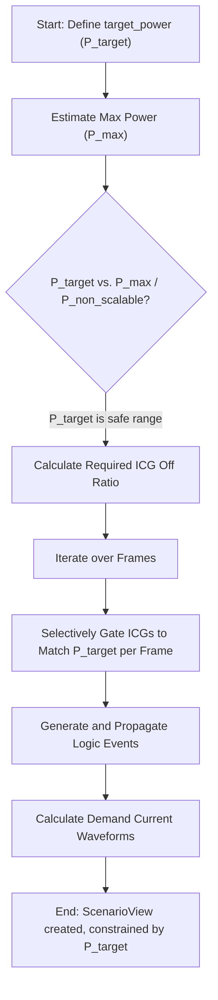

**One-Line Summary:** Setting a `target_power` in a Power-Constrained Vectorless Scenario (PCVS) forces RedHawk-SC's analytical engine to modulate the activity of Integrated Clock Gating (ICG) cells and sequential logic to synthesize a logically consistent transient switching scenario that matches the defined power consumption limit.

### Details:

The fundamental role of the `target_power` constraint in a PCVS flow is to guide the generation of a **realistic, logic-coherent switching sequence** that precisely meets a user-specified power budget. This is essential because, unlike simpler vectorless methods (such as NPV), PCVS ensures the generated events are logically consistent while adhering to resource limits.

### Necessity of Power-Constrained Scenario

Dynamic Voltage Drop (DVD) analysis evaluates the instantaneous voltage fluctuations caused by peak current demand, a state that does not typically occur under average switching conditions. While traditional static IR analysis relies on average power, determining peak consumption requires specific switching vectors.

PCVS addresses the lack of available external functional vectors (VCD/FSDB) by internally generating a vector that is tailored to stress the power grid up to a defined limit. The scenario ensures that the generated event sequence is logically consistent (logic-coherent) by propagating events through the netlist and timing information.

### Methodology: Modulating Activity to Match Target

The PCVS mechanism is primarily achieved by dynamically controlling two main factors: Integrated Clock Gating (ICG) switching and sequential element toggle rates.

**1. Primary Control: ICG Gating**

The crucial difference of PCVS from other vectorless flows is its focus on controlling ICGs to meet the power constraint.

*   **Estimation:** The flow first estimates the total power contribution of each ICG and all the downstream logic (its fanout cone).
*   **Modulation:** Based on this estimation, a calculated subset of ICGs are selectively disabled (turned off) to ensure the scenario's resulting power draw matches the target.
*   **Coverage:** The scenario is typically divided into multiple **frames** (time intervals). Different sets of ICGs are chosen for each frame, maximizing the number of ICGs that are active over the total scenario duration, thereby providing high switching coverage for the clock gating elements.

**2. Secondary Control: Sequential Toggle Rates**

While ICG control is the principal method, PCVS may also tweak the statistical switching probabilities (toggle rates) of sequential start points (flip-flops and latches) if ICG control alone is insufficient to precisely meet the `target_power`.

The input `target_power` is typically specified in Watts, either for the top design level, per block, or per voltage domain, using the `target_power` key under the settings dict of the `SeaScapeDB.create_scenario_view` command.

### Flowchart: PCVS Scenario Generation

The overall process relies on the relationship between the requested power and the maximum power capacity of the design, modulated by controlling the major power consumers (ICGs):

### Equations Relevant to Power Constraints

The target power mechanism aims to manage the components of power consumption:

$$P_{total} = P_{dynamic} + P_{static}$$

Where the dynamic power for an instance is strongly tied to its switching activity ($TR$), load capacitance ($C$), and supply voltage ($V_{dd}$), all factors implicitly managed by the PCVS synthesis process:

$$P_{dynamic} = P_{switching} + P_{internal}$$

$$P_{switching} \propto C \cdot V_{dd}^2 \cdot TR$$

By constraining the total power ($P_{total}$) and knowing the static leakage ($P_{static}$), the PCVS engine calculates the necessary scaling of the dynamic activity ($P_{dynamic}$) through controlling the primary (ICG) and secondary (sequential) switching mechanisms.

### References
*   **Source:** RedHawk-SC_v23R2_User_Manual.md - Ansys, Inc.
*   **Source:** Low Power Methodology Manual For System-on-Chip... (Z-Library).pdf - Robert Aitken et al.
*   **Source:** Analysis of IR Drop for Robust Power Grid... - Bushra Fatima and Rajeevan Chandel
*   **Source:** Synopsys® Multivoltage Flow User Guide - Synopsys, Inc.
*   **Source:** Power Compiler™ User Guide - Synopsys, Inc.
