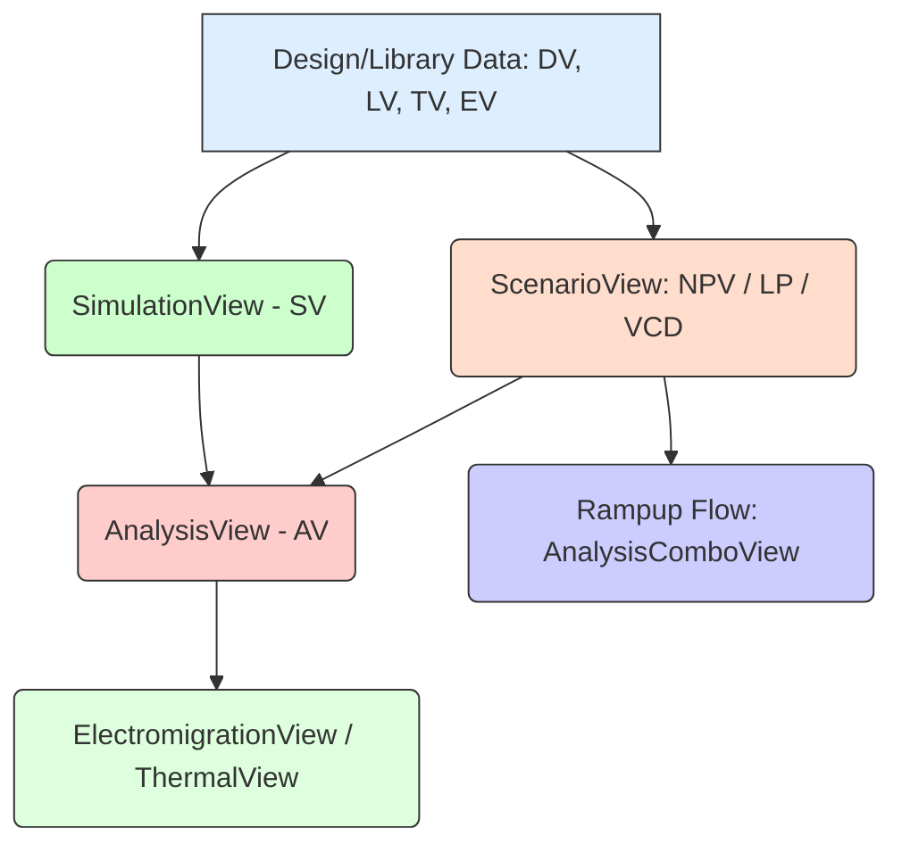

**One-Line Summary:** RedHawk-SC analysis requires base views (Design, Tech, Liberty, Extract, Timing) to define the physical and electrical context, followed by specialized inputs like switching activity data (for static/dynamic analysis), current models (APL/CCS), and specific rule files (for EM/ESD) to perform detailed checks.

### Details:
RedHawk-SC represents a significant evolution from the classic RedHawk tool, utilizing the Ansys SeaScape™ big data architecture to execute full-chip power-noise and reliability sign-off. Its comprehensive analysis capability is structured around a sequential flow of data defined in specialized views.

#### RedHawk-SC vs. Classic RedHawk

| Feature | Classic RedHawk (Legacy) | RedHawk-SC (SeaScape) |
| :--- | :--- | :--- |
| **Architecture** | Single-kernel, traditional architecture. | Distributed architecture using Master and Worker processes for elastic scalability. |
| **Data Storage** | Uses traditional file outputs and internal data structures; output files often stored in directories like `adsRpt`. | Uses SeaScape Database (DB) where data is organized into "Views" (containers for related data, e.g., DesignView, AnalysisView). |
| **Scalability** | High capacity, but limited by single-process memory/CPU constraints. | Per-core scalability across multiple machines using big data techniques; critical for managing multi-billion instance designs. |
| **Analysis Paradigm** | Sequential flow, batch mode emphasis. | Simultaneous analysis, instantaneous results, and real-time monitoring/querying possible (using Python shell/GUI). |
| **Advanced Features** | Core focus on traditional Static IR/Dynamic analysis. | Integrated support for 3DIC analysis, multichip-package co-analysis, thermal analysis (SelfHeat), machine learning applications, and vector scoring/slicing for long vectors. |

#### Key Concepts for RedHawk-SC Power Signoff

For a Power Signoff interview focused on RedHawk-SC, proficiency in the hierarchical data structure (Views) and the specifics of dynamic analysis (DVD, EM, Rampup) is essential.

1.  **Core Views (Design Hierarchy and Electrical Modeling)**
    Signoff requires a robust hierarchy and accurate electrical libraries.

| View Type | Purpose and Key Inputs | Significance for Signoff |
| :--- | :--- | :--- |
| **DesignView (DV)** | Stores netlist, physical layout (DEF/LEF), and instance hierarchy. | Mandatory root view for all subsequent analysis. |
| **LibertyView (LV)** | Stores electrical models, timing arcs, switching current profiles (APL/CCS), leakage, and power gate models. | Crucial input for accurate dynamic analysis (requires APL/CCS waveforms). |
| **ExtractView (EV)** | Holds parasitic data (R, L, C network), shorts, disconnects, and SPR (Shortest Path Resistance) data. | Provides the non-ideal RLC power delivery network (PDN) model required for simulation. |
| **TimingView (TV)** | Stores SDC constraints, slews, timing windows (TWs), and clock domains (from STA). | Required to model when events occur, enabling temporally accurate dynamic simulation and DVD parameter calculation (e.g., MinTW). |

2.  **Scenario Modeling for Dynamic Voltage Drop (DVD)**
    Dynamic analysis relies on instantaneous peak current ($I_{peak}$), making current modeling the critical factor for accuracy.

    *   **APL/CCS Requirement:** Dynamic analysis requires accurate current models (time-variant switching profiles) provided by APL or CCS libraries. Traditional Liberty (.lib) NLPM data is often pessimistic and lacks the required transistor-level accuracy for transient analysis.
    *   **Scenario Types for Current Generation:**
        *   **NPV (No-Propagation Vectorless):** Creates events based on statistics (toggle rate, target power) for high coverage/speed, intentionally ignoring logic correlation.
        *   **Logic Propagation (LP):** Creates logic-coherent events, simulating the functional spread of activity through delays, yielding realistic temporal and logical correlation.
        *   **Vector-Based:** Uses VCD/FSDB files, typically used late in the flow with gate-level VCD for maximal accuracy.

3.  **Rampup Analysis (Power Gating Signoff)**
    Rampup analysis verifies the power-up sequence of power-gated designs to manage rush current and voltage integrity.

    *   **Key Inputs:** Requires APL switch model files and APL PieceWise Cap (PWCAP) files in LibertyView. It also needs LSO (Logic Signal Override) files to sequence the switch control timing.
    *   **Flow:** The resulting AnalysisView is often combined with an always-on scenario using the **AnalysisComboView** to study the full impact on the SoC during power-up.

4.  **Reliability Checks**
    *   **Electromigration (EM):** Performed using the **ElectromigrationView**, comparing RMS or PEAK currents (from the AnalysisView) against limits specified in the TechView.
    *   **Thermal Awareness:** High temperature exponentially increases leakage current. Thermal results (from **ThermalView** running SelfHeat analysis) are fed back to the ElectromigrationView to adjust EM limits for thermally-aware sign-off.

#### RedHawk-SC Input File Requirements by View

RedHawk-SC, built on the scalable Ansys SeaScape framework, structures its input data into mandatory and optional Views. The following table details the critical input files, their primary purpose, the corresponding View they populate, and supported formats, which often include gzip (`.gz`) compression.

| File Type (Common Extensions) | Content/Purpose | Consuming View | Notes on Format/Syntax |
| :--- | :--- | :--- | :--- |
| **Design/Layout** | | | |
| Design Exchange Format (`.def`, `.defs`, `.def.gz`) | Physical netlist, placement, hierarchical structure, and Power/Ground (PG) network definition. | `DesignView` | ASCII format; last file must be the top-level block. Supports compression (`.gz`). |
| Library Exchange Format (`.lef`, `.lefs`) | Physical dimensions, layer rules, and cell pin definitions. | `DesignView` | The first `.lef` file should contain technology layer and via information. |
| Pad Location File (`.ploc`) | Coordinates, layer assignments, and names of external PG sources (pads/bumps). | `ModifiedDesignView` | Used as input to hook up the PG voltage sources. |
| GDSII File (`.gds`, `.gdsii`) | Physical geometry data (GDS) for macros, memories, and RDL. Used for conversion to DEF/LEF abstractions. | `DesignView` or via `MacroView` | Used when physical models are required for custom IP. |
| **Electrical/Modeling** | | | |
| Synopsys Liberty (`.lib`, `.libs`) | Logical descriptions, timing/power arcs, Non-Linear Delay Model (NLDM), Non-Linear Power Model (NLPM), and leakage characterization. | `LibertyView` | Used primarily for calculating static/average power. |
| APL/CCS Files (`.apl`, `.spiprof`, `.current`) | High-fidelity, time-variant current waveform profiles, intrinsic decap (ESC), effective series resistance (ESR), needed for dynamic transient analysis. | `LibertyView` | Essential for transistor-level accuracy during dynamic verification. |
| APL Switch Model (`.model`, `.aplsw.out`) | Detailed 3D switch characteristics (ON/OFF state resistance, current profiles) for power gating elements. | `LibertyView` | Generated by external tool (`aplsw`) using SPICE simulation. |
| **Activity/Timing** | | | |
| Timing/STA File (`.timing`, `.sta.gz`) | Instance minimum/maximum transition times, timing windows (TWs), slews, and clock domains. | `TimingView` | Required for dynamic analysis accuracy; identifies clock tree instances and activity windows. |
| SDC Constraints (`.sdc`) | Timing constraints, load capacitance specifications, and design assertions. | `TimingView` | Defines design behavior and constraints. |
| VCD/FSDB (`.vcd`, `.fsdb`) | Vectorized switching activity waveform data (events). | `ValueChangeView` | Stores complete temporal information of events, referenced by slices. |
| SAIF File (`.saif`) | Switching Activity Interchange Format (toggle count, T0/T1 probabilities). | `SwitchingActivityView` | Used primarily for static power estimation flow. |
| Logic Signal Override (`.lso`) | Explicit logic state assignments and timing control for critical net pins (e.g., power switch control signals). | `ScenarioView` | Overwrites default or VCD-derived activity/timing. |
| **Parasitics/System** | | | |
| SPEF/DSPF (`.spef`, `.dspf`, `.spef.gz`) | Signal net R, C, L parasitics (external source). | `ExtractView` | Required for accurate load modeling and signal EM analysis. |
| Package Model Files (`.sp`, `.sNp`, `.pkg`) | RLCK SPICE netlist or S-parameter models for off-chip PDN. | `SimulationView` | SPICE netlist must define the `REDHAWK_PKG` subcircuit. |
| Technology File (`.tech`, `.ircx`) | Core material parameters, resistivity, thickness, extraction technology info, and electromigration rules. | `TechView` | Mandatory input for RC(L) extraction and EM limit checks. |

#### Analytical Representation (Dynamic Analysis)

Dynamic Voltage Drop (DVD) is caused by the instantaneous peak current ($I_{peak}$) drawn by switching circuits across the non-ideal impedance ($Z_{PG}$) of the Power/Ground network.

$$
V_{DVD}(t) = I_{Demand}(t) \cdot Z_{PG}(j\omega)
$$

The calculation of the transient current waveform for instance $i$ uses specialized models derived from characterization data (APL/CCS) which include capacitance ($C$), resistance ($R_{on}$), supply voltage ($V_{DD}$), and the input transition time ($t_{slew}$):

$$
I_{Demand,i}(t) \propto f(C, R_{on}, V_{DD}, t_{slew})
$$

Where $Z_{PG}$ includes R, L, and C components extracted from the layout.

#### RedHawk-SC Dynamic Analysis Flow

The core workflow relies on sequential dependency across Views:

### References
*   **Source:** Low Power Methodology Manual For System-on-Chip
*   **Source:** RedHawk-SC User Manual
*   **Source:** RedHawk-SC Reference Manual
*   **Source:** RedHawk User Manual
*   **Source:** Analysis of IR Drop
*   **Source:** Analysis of IR Drop for Robust Power Grid
