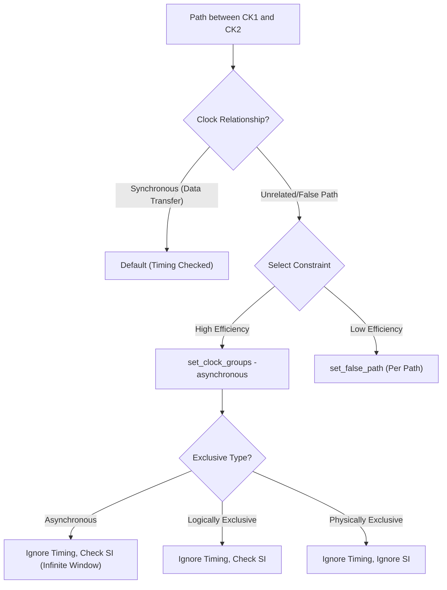

**One-Line Summary:** Explains the efficient management of unrelated clock domains using `set_clock_groups` compared to individual false paths, detailing Asynchronous, Logically Exclusive, and Physically Exclusive relationships and their impact on SI.

## I. Inefficiency of Individual False Paths

The reason using individual `set_false_path` commands for every flip-flop pair crossing clock domains is incorrect is primarily due to **efficiency and scalability**.

*   **False Path Drawback:** Manually specifying `set_false_path -from [get_cells <launch_ff>] -to [get_cells <capture_ff>]` is tedious, error-prone, and computationally expensive for complex designs with thousands of crossing paths.
*   **Clock Groups Advantage:** The recommended solution, **`set_clock_groups -asynchronous`**, provides a single, efficient command to handle the relationship between entire clock domains.

## II. Clock Group Relationships (`set_clock_groups`)

The `set_clock_groups` command defines the relationships between multiple clock domains, determining how PrimeTime handles timing and crosstalk checks between them.

| Clock Group Type | SDC Command Option | Definition and Purpose | Timing Analysis (STA) | Signal Integrity (SI) / Crosstalk Analysis |
| :--- | :--- | :--- | :--- | :--- |
| **Asynchronous** (Most Efficient for Unrelated Clocks) | `-asynchronous` | Clocks have no fixed phase relationship, meaning clock edges occur at arbitrary times relative to each other. | **Timing paths are ignored** (similar to `set_false_path`). | **Crosstalk checked** using **infinite arrival windows** for conservative analysis. |
| **Logically Exclusive** | `-logically_exclusive` | Only one clock in the exclusive group is active at a time; physically, they may share nets or coupling capacitors. | **Timing paths are ignored**. | **Crosstalk checked**. |
| **Physically Exclusive** | `-physically_exclusive` | Clocks are physically isolated (e.g., separated by distance or isolation barriers) and cannot interact logically or physically. | **Timing paths are ignored**. | **Crosstalk is ignored** (no check performed), thereby eliminating pessimistic crosstalk analysis. |

### Note on Asynchronous Clocks and Path Timing

While the default behavior of **`-asynchronous`** is to prevent checking paths between the domains, the user can restore logical timing checks using the **`-allow_paths`** option. Even with timing restored, PrimeTime SI still uses infinite alignment windows for highly conservative crosstalk analysis between the groups.

## III. Comparison to Default Synchronous Behavior

If no relationship is specified, PrimeTime assumes the clocks are **synchronous** if there is any data path between them.

| Relationship | Specification | Timing/Crosstalk Implication |
| :--- | :--- | :--- |
| **Synchronous** (Default) | Implicit (no `set_clock_groups`) | PrimeTime attempts to find a common base period (least common multiple) and checks **all timing paths** between clock edges in the expanded period. |
| **Unconstrained** | Implicit (no `create_clock` or exceptions) | Paths are placed in the **default** path group or left **unconstrained** and typically reported by tools like `check_timing`. |

### Decision Flow: Handling Clock Domains

## IV. Analogy: Traffic Laws

You can think of the Clock Group constraints like traffic laws governing two neighborhoods (clock domains).

1.  **Asynchronous** means the neighborhoods have no coordination (unconstrained, like random traffic flows). The police (STA) know there is potential danger at the borders, so they issue universal warnings (ignore timing paths). SI police (PrimeTime SI) check every interaction because they assume the worst timing (infinite windows).
2.  **Logically Exclusive** means the gate guarding the bridge between them ensures only one neighborhood's traffic can enter at a time. STA police still ignore traffic between them. SI police still check conservatively because the road segments are still physically close.
3.  **Physically Exclusive** means the bridge was completely removed and replaced with two entirely separate, parallel tunnels. STA ignores traffic. Crucially, the SI police stop worrying about collision/coupling at the connection point because there is no physical proximity anymore.

> [!QUESTION]
> **Scenario:** A design contains a path between two different, unrelated clock domains, CK1 and CK2. By default, PrimeTime will try to time this path. To prevent this and improve runtime, what is the most efficient SDC command to use?
>
> **Incorrect Answer:** "set_false_path -from [get_cells <launch_ff>] -to [get_cells <capture_ff>] for every cross-domain flip-flop pair."
>
> **Correct Answer:** "set_clock_groups -asynchronous -group {CK1} -group {CK2}"

## References
*   **Source:** *Static Timing Analysis for Nanometer Designs* by Rakesh Chadha.
