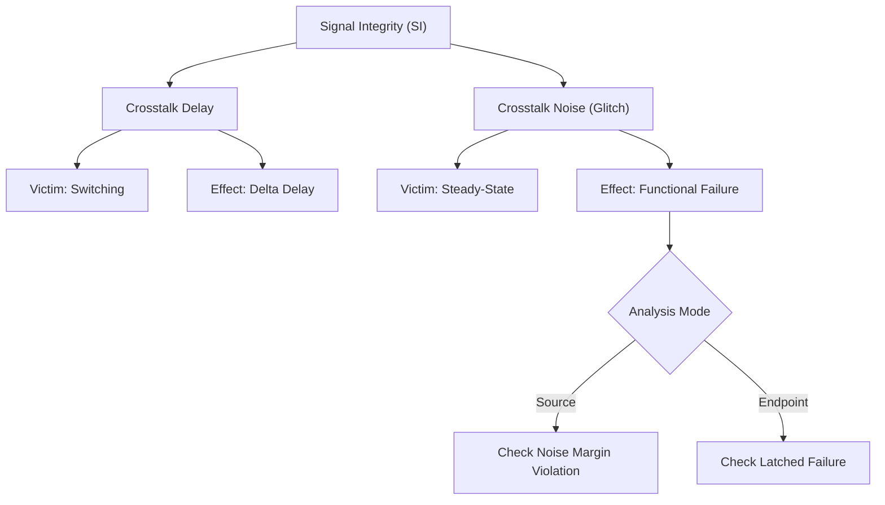

**One-Line Summary:** Distinguishes between crosstalk delay (timing) and crosstalk noise (glitches), detailing analysis modes and noise bump types in Signal Integrity (SI) analysis.

## I. Distinction Between Glitch, SI, and Noise in Timing Analysis

In the context of Static Timing Analysis (STA), "SI" (Signal Integrity) refers to the analysis domain that encompasses both **crosstalk delay effects** and **crosstalk noise effects (glitches)**. The distinction between these effects is defined by the activity of the victim net:

| Term | Phenomenon | Victim Net Activity | Resulting Timing Concern |
| :--- | :--- | :--- | :--- |
| **Crosstalk Delay / SI Timing** | The interaction between neighboring switching nets affects transition time. | **Switching** (in transition from 0 to 1 or 1 to 0). | Causes a change (delta delay) in the path timing, leading to potential setup or hold violations. |
| **Glitch / Crosstalk Noise** | Capacitive coupling induces a voltage spike on a neighboring wire. | **Steady-State** (quiet, held constant at logic 1 or logic 0). | The voltage bump may cause an incorrect logic value to be propagated, resulting in a functional failure.|

## II. Noise Analysis Modes

Noise analysis is performed using the `update_noise` command, which relies on noise models present in the cell library, such as **Composite Current Source (CCS) noise** or **Nonlinear Delay Model (NLDM)**.

PrimeTime SI provides two main analysis modes for reporting and fixing logic failures caused by noise:

1.  **"Report at Source" Mode (Default):**
    *   The tool reports violations at the original location (source) where the calculated noise bump exceeds the defined **noise immunity curve** or noise margin for that cell's input pin.
    *   This mode provides a **complete report** that includes all noise immunity violations, whether or not they are ultimately captured by a sequential element.
    *   If a logic failure is detected, the input noise bump's height is often reduced (by a default factor of 0.75) for propagation, allowing analysis to continue in the fanout.

2.  **"Report at Endpoint" Mode:**
    *   The tool reports violations only at the **endpoints** of the noise path where the logic failure causes an incorrect value to be latched, such as at the clock, data, or asynchronous pins of flip-flops.
    *   This mode produces a **more concise report** because it typically includes only noise violations that are determined to be latched as incorrect data.

## III. Four Noise Bump Types

PrimeTime SI analyzes noise based on four primary types of voltage bumps or glitches induced on a steady-state victim net. These bumps are categorized based on whether they stay within the voltage rails (VDD and VSS/GND) or go beyond them ("beyond rail"):

1.  **Above Low (Rise Glitch):** Occurs on a steady **logic 0** net, where the bump voltage increases but remains below the supply voltage (VDD).
2.  **Below High (Fall Glitch):** Occurs on a steady **logic 1** net, where the bump voltage decreases but remains above ground (GND).
3.  **Above High (Overshoot):** Occurs on a steady **logic 1** net, where the bump voltage deviates *above* VDD. This type of bump is important because it can forward-bias pass transistors at sequential element inputs.
4.  **Below Low (Undershoot):** Occurs on a steady **logic 0** net, where the bump voltage deviates *below* GND. This also matters due to potential forward-biasing issues.

### SI Analysis Classification

## References
*   **Source:** *Static Timing Analysis for Nanometer Designs* by Rakesh Chadha.
*   **Related:** [[reducing_si_pessimism_with_exclusion]]
