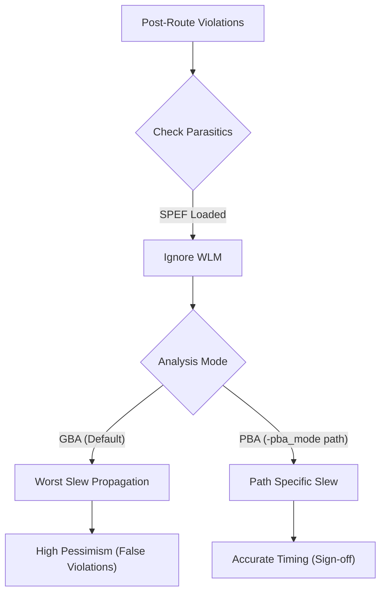

**One-Line Summary:** A detailed comparison of Graph-Based Analysis (GBA) and Path-Based Analysis (PBA), explaining GBA's pessimism due to worst-slew propagation and PBA's accuracy for sign-off, particularly in post-route timing analysis with SI.

## I. Why WLM is Irrelevant Post-Route

The issue with attributing post-route timing discrepancies to the Wire Load Model (WLM) and recommending `set_wire_load_mode top` stems from the nature of the design flow:

1.  **WLM is Pre-Layout:** Wire Load Models (WLM) are utilized during the **pre-layout** phase or placement stage (P&R, STA) to estimate net parasitic capacitance and resistance based on the number of fanouts. Placement is the process of automatically placing standard cells in rows such that timing constraints are met.
2.  **Post-Route uses Extracted Parasitics:** In the **post-route** scenario, the actual physical interconnections (routing) are complete. At this stage, detailed parasitic data (RC values) are extracted by an extraction tool and imported into PrimeTime, typically in formats like SPEF (Standard Parasitic Exchange Format). The timing delay calculation shifts from using the WLM estimates to using these accurate, detailed **extracted RC values**.
3.  **Irrelevance of `set_wire_load_mode top`:** Since the design is post-route, the WLM is no longer the method used for delay calculation. Thus, adjusting the `set_wire_load_mode` (which governs how WLM is applied across hierarchy) will not affect the analysis results based on the actual extracted parasitics.

## II. Note on GBA vs. PBA and Pessimistic Slew Propagation

The core issue resulting in significant setup violations post-route, particularly when crosstalk (Signal Integrity or SI) analysis is enabled, is the inherent **pessimism of Graph-Based Analysis (GBA)**, which is removed by running **Path-Based Analysis (PBA)**.

| Feature | Graph-Based Analysis (GBA) | Path-Based Analysis (PBA) |
| :--- | :--- | :--- |
| **Primary Goal** | Provides a **fast, exhaustive timing coverage** for the entire design. | Provides the **most accurate timing result** by performing a path-specific calculation. |
| **Speed/Runtime** | Faster, optimized for full-design processing. | Slower, computationally intensive; typically used only for analyzing specific critical violating paths. |
| **Slew Handling** | Uses **Slew Merging** (Worst Slew Propagation). When multiple arcs meet, the tool selects the **worst (slowest) slew** to propagate forward, leading to pessimism. | **Recalculates slew** specifically for the path being analyzed, ignoring off-path pessimism. This calculation removes the pessimism introduced by GBA. |
| **Slew-Induced Pessimism** | If the worst slew is chosen from a side path (not the critical path itself), the subsequent cell delay calculation uses an artificially slow input transition, making the path delay unnecessarily longer. | Eliminates artificial delay added due to conservative slew choices in GBA. |
| **Use Case** | Timing verification after synthesis, placement, and initial routing phases (full design validation). | Final verification on violating paths (e.g., using `report_timing -pba_mode path`) for sign-off accuracy. |

## III. Why Worst Slew Propagation and SI Increase Post-Route Violations

The combination of GBA's inherent pessimism and the introduction of accurate interconnect characteristics (including coupling capacitance) during the post-route phase significantly contributes to the appearance of new setup violations:

1.  **GBA Pessimism:** GBA uses the **worst slew propagation** mode by default when performing max path analysis. This ensures the analysis is conservative by selecting the maximum (slowest) transition time found at a common point to drive the next stage. This artificially inflated slew leads to a pessimistically calculated cell delay for the next stage.
2.  **Crosstalk Amplification (SI):** Once **crosstalk analysis is enabled** and detailed parasitics (including coupling capacitance) are provided post-route, the interaction between neighboring switching nets is modeled. A **slower slew on the victim net (caused by GBA's pessimism)** makes that net **more susceptible** to slowdown effects induced by coupling from aggressor nets (**positive crosstalk**). This compounding effect results in the "significant setup violations" being reported only after the transition to post-route, sign-off quality analysis.
3.  **PBA as the Fix:** To determine if these reported violations are genuine or merely artifacts of GBA's pessimism, the designer must use **Path-Based Analysis (PBA)** via commands such as `report_timing -pba_mode path`. PBA recalculates the signal propagation and delay specifically for that critical path, accurately modeling the true slew along the path, thereby removing the artificial delay added by GBA.

### Decision Flow

> [!QUESTION]
> **Scenario:** In a post-route timing analysis scenario, you observe significant setup violations that were not present during placement. Standard ECOs like cell sizing are ineffective. Given that crosstalk analysis is enabled, what is the most likely reason for this discrepancy and which PrimeTime analysis mode would provide the most accurate, albeit slower, timing result for the failing paths?
>
> **Incorrect Answer:** "The issue is likely due to an inaccurate wire load model (WLM) used during placement. The most accurate analysis would be rerunning with the set_wire_load_mode top command."
>
> **Correct Answer:** "The problem stems from pessimistic slew propagation in Graph-Based Analysis (GBA). The most accurate result is obtained using Path-Based Analysis (report_timing -pba_mode path) which recalculates slew for the specific path."

## References
*   **Source:** *Static Timing Analysis for Nanometer Designs* by Rakesh Chadha.
*   **Related:** [[crosstalk_delay_vs_noise]]