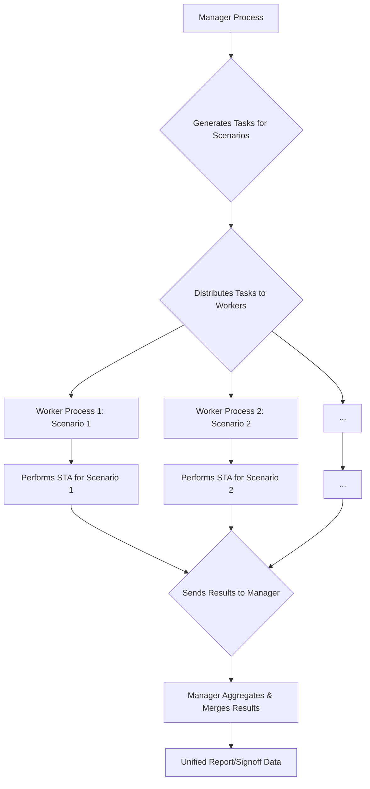

**One-Line Summary:** This note details Multi-Mode Multi-Corner (MMMC) analysis techniques, including Distributed Multi-Scenario Analysis (DMSA) for parallel execution and Simultaneous Multivoltage Analysis (SMVA) for reducing pessimism in multivoltage designs.

## I. Multi-Mode Multi-Corner (MMMC) Analysis

MMMC analysis refers to performing Static Timing Analysis (STA) across multiple **operating modes** (e.g., Functional, Test, Sleep) and various **PVT (Process, Voltage, Temperature) corners** simultaneously. The goal is to verify the design against all required operating scenarios.

The three main analysis modes utilized to address PVT variation effects are Single Operating Condition, Best-Case/Worst-Case (BC_WC), and On-Chip Variation (OCV).

| Analysis Mode | Timing Setup Performed | Timing Check Logic (Setup Check) | Purpose |
| :--- | :--- | :--- | :--- |
| **Single Operating Condition** | One set of PVT (e.g., only WORST). | Uses **maximum delay** for all paths (launch clock path, data path, capture clock path). | Basic, fastest analysis; requires multiple runs to cover all corners. |
| **Best-Case/Worst-Case (BC_WC)** | Two operating conditions (min/max) defined globally. | Uses **maximum delay** for data path/launch clock path; uses **minimum delay** for capture clock path. | Conservative analysis where worst-case data must meet best-case clock. |
| **On-Chip Variation (OCV)** | Two operating conditions (min/max) defined globally. | Uses **maximum delay** for launch clock path and data path; uses **minimum delay** for capture clock path. | This is a conservative analysis that models localized PVT variations within a single die, where the launch and capture paths may see different delay variations. |

## II. The Core Role of the DMSA Manager Process

The **manager process** is the central coordinating entity in DMSA, responsible for structuring the analysis and managing the distributed environment. Its functions extend far beyond just license distribution.

| Manager Function | Description |
| :--- | :--- |
| **Central Data and Netlist Holder** | The manager holds the **full design netlist** and the multi-scenario data. It stores the design information needed to coordinate the analysis. |
| **Task Generation and Distribution** | The manager **generates analysis tasks** for each scenario defined by the user and **manages the distribution of those tasks** to the worker processes. |
| **License Management** | The manager performs **all license management**. It acquires licenses from the central license server and dynamically distributes them to the worker processes as needed when a worker is actively executing a task. |
| **Results Aggregation/Merging** | When processing is complete, the manager **merges the results** from all scenarios (e.g., from `report_timing`, `report_constraint`) into a unified report view, eliminating redundant data and sorting results by criticality. |

### Why an Answer Focusing Solely on Licensing is Insufficient

While the manager performs license management, focusing solely on that misses the overarching mandate of the DMSA flow: speeding up MMMC analysis by leveraging parallel computing. The manager acts as the *command and control center* for the distributed analysis, managing the data and coordinating the work.

## III. Advanced MMMC Execution Architectures

DMSA and SMVA are techniques to manage the scale and complexity of the MMMC timing space.

### A. Distributed Multi-Scenario Analysis (DMSA)

DMSA is a parallel processing technique designed to reduce the **overall runtime (turnaround time)** when analyzing a large number of independent scenarios.

| Feature | Distributed Multi-Scenario Analysis (DMSA) |
| :--- | :--- |
| **Primary Goal** | **Reduce total computation runtime** by distributing individual scenario analyses across multiple CPU cores or hosts. |
| **Architecture** | A single **manager process** orchestrates multiple **worker processes** (one per scenario) that run analysis in parallel. |
| **Input Scenario** | Typically handles **different PVT corners or different operating modes** (e.g., fast-read, slow-write). |
| **Data Handling** | The manager loads the netlist once but only delegates and **merges** the results from the individual scenarios run by workers. Data common to multiple scenarios (e.g., netlist topology) can be shared among workers. |
| **Pessimism Reduction** | It improves efficiency but **does not inherently reduce pessimism**; it runs standard STA (like OCV mode) separately for each scenario. |

### B. Simultaneous Multivoltage Analysis (SMVA)

SMVA is a graph-based timing analysis method specifically designed to verify designs containing **multiple power domains** operating at potentially multiple supply voltage levels, especially those implementing Dynamic Voltage and Frequency Scaling (DVFS).

| Feature | Simultaneous Multivoltage Analysis (SMVA) |
| :--- | :--- |
| **Primary Goal** | **Remove pessimism** in cross-domain path analysis by considering all relevant voltage level combinations simultaneously in a single run. |
| **Architecture** | Graph-based analysis where the tool considers every valid voltage combination for each path concurrently within a single run. It often leverages **scaling library groups**. |
| **Input Scenario** | Focuses on varying **supply voltages** (e.g., VDD low/high) and associated timing constraints across different power domains (DVFS scenarios). |
| **Pessimism Reduction** | **Reduces pessimism** in cross-domain paths that traverse different voltage domains by analyzing only physically possible voltage combinations, rather than worst-case OCV bounds. |

## IV. Summary of Differences

| Aspect | DMSA | SMVA |
| :--- | :--- | :--- |
| **Core Function** | Parallel execution of many independent scenarios. | Simultaneous analysis of many dependent voltage combinations in one run. |
| **Primary Benefit** | Faster overall runtime (time-to-results). | More accurate/less pessimistic timing results for multivoltage designs. |
| **Applicable Constraint** | PVT corner analysis, Operating mode analysis. | Supply voltage levels, DVFS scenarios, and cross-domain paths. |
| **Relationship** | DMSA can distribute the execution of SMVA scenarios, combining parallelization with complex analysis capability. | SMVA is a mode of analysis that can be run concurrently under DMSA. |
| **Prerequisites** | Host resources (CPUs, licenses) for multiple workers. | UPF/Multivoltage information and voltage scaling library groups. |

## Flow Diagram: DMSA Architecture

## Quiz

> [!QUESTION]
> **Question:** When using Distributed Multi-Scenario Analysis (DMSA) in PrimeTime, what is the primary role of the 'manager' process?
>
> **Incorrect Answer:** It acts as a license server, checking out licenses and distributing them to the worker processes as needed.
>
> **Correct Answer:** It holds the full design netlist, generates analysis tasks for each scenario, distributes them to worker processes, and merges the results.

## References
*   **Source:** *Static Timing Analysis for Nanometer Designs* by Rakesh Chadha.
