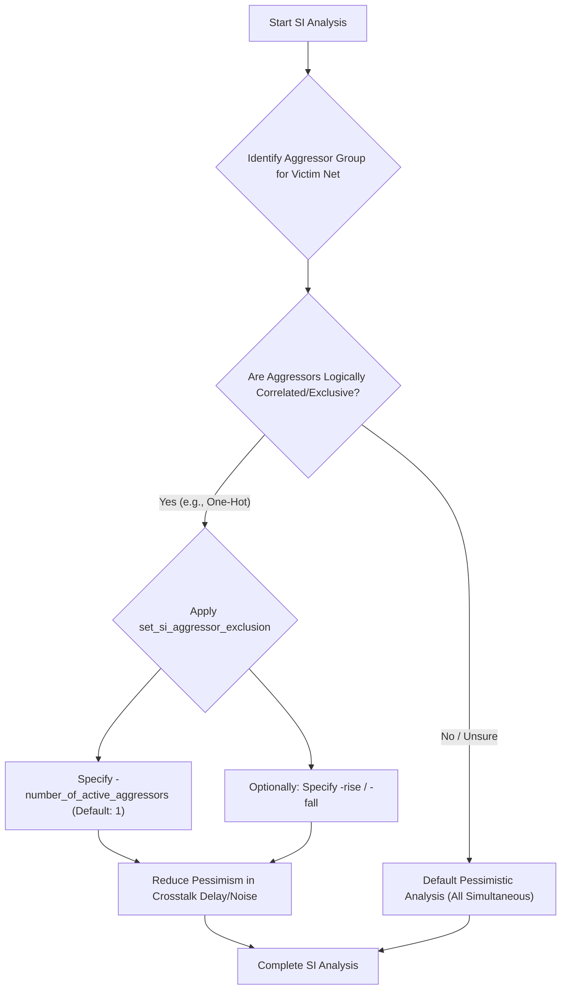

**One-Line Summary:** Explains the `set_si_aggressor_exclusion` SDC command, used to reduce pessimism in Signal Integrity (SI) crosstalk analysis by specifying that certain aggressor nets cannot switch simultaneously.

## Purpose: Reducing Pessimism in SI Analysis

The `set_si_aggressor_exclusion` command is crucial for Signal Integrity (SI) analysis to manage conservative assumptions employed by Static Timing Analysis (STA) tools regarding worst-case signal behavior. By default, PrimeTime SI assumes the worst-case scenario where multiple aggressors switch concurrently and in the same direction, which can be overly pessimistic.

### I. Function and Purpose of `set_si_aggressor_exclusion`

This command specifically manages the **functional correlation** between multiple aggressor nets.

1.  **Reducing Pessimism:** It prevents the tool from making unrealistic worst-case assumptions about simultaneous switching of multiple aggressors.
2.  **Excluding Simultaneous Switching:** This command specifies groups of aggressor nets among which only a maximum specified number of aggressors can switch simultaneously in the same direction. This aligns the analysis with the actual design logic (e.g., logically inverse signals, one-hot decoders).

### II. Application in Crosstalk Analysis

The command is essential for reducing unnecessary pessimism in both **crosstalk delay** and **crosstalk noise** analysis:

*   **Crosstalk Delay Analysis:** When multiple aggressors are physically coupled to a victim net, their individual contributions to timing change (delta delay) are typically accumulated. If aggressors are constrained as exclusive, PrimeTime SI considers this restriction during timing window overlap analysis and calculates the cumulative delay based on the fact that only a limited number of these nets can be active together.
*   **Crosstalk Noise Analysis:** For noise calculations, crosstalk is often compounded due to multiple aggressors. This command ensures that the computation of the maximum possible glitch (noise bump) resulting from multiple aggressors respects the physical impossibility of certain nets switching simultaneously. For example, in a one-hot decoder, where only one signal is active at a time, defining the corresponding nets as an exclusive group prevents the analysis from assuming all signals switch together, which would result in an unrealistically large noise bump.

### III. Command Options

The exclusion can be refined using these options:

*   **`-rise` or `-fall`:** These options restrict the exclusivity to the specified transition direction. If neither is used, the exclusion applies to both rising and falling directions.
*   **`-number_of_active_aggressors`:** This option allows you to specify the maximum number of aggressors within the exclusive set that can switch simultaneously. If omitted, the default is typically one active aggressor.

### IV. Precedence and Interaction with Other Commands

The `set_si_aggressor_exclusion` command is part of a hierarchy of constraints used in SI analysis:

*   **Relationship to `set_si_delay_analysis` / `set_si_noise_analysis`:** If an aggressor is excluded globally using `set_si_delay_analysis -exclude` (or `set_si_noise_analysis -exclude`), it remains excluded. If it is part of a composite aggressor group, the exclusion logic applies during the statistical analysis of that composite group.
*   **Precedence over False Paths:** Similar to `set_clock_groups`, this command establishes a relationship based on logical or physical conditions, which generally helps clean up constraints more efficiently than individual `set_false_path` commands for specific nets.

### Flowchart: Using set_si_aggressor_exclusion

## References
*   **Source:** *Static Timing Analysis for Nanometer Designs* by Rakesh Chadha.

> [!QUESTION]
> **Question:** In a PrimeTime SI analysis, what is the purpose of the `set_si_aggressor_exclusion` command?
>
> **Correct Answer:** To inform the tool that a specified group of aggressor nets will not switch simultaneously in the same direction, reducing pessimism in noise calculation.

