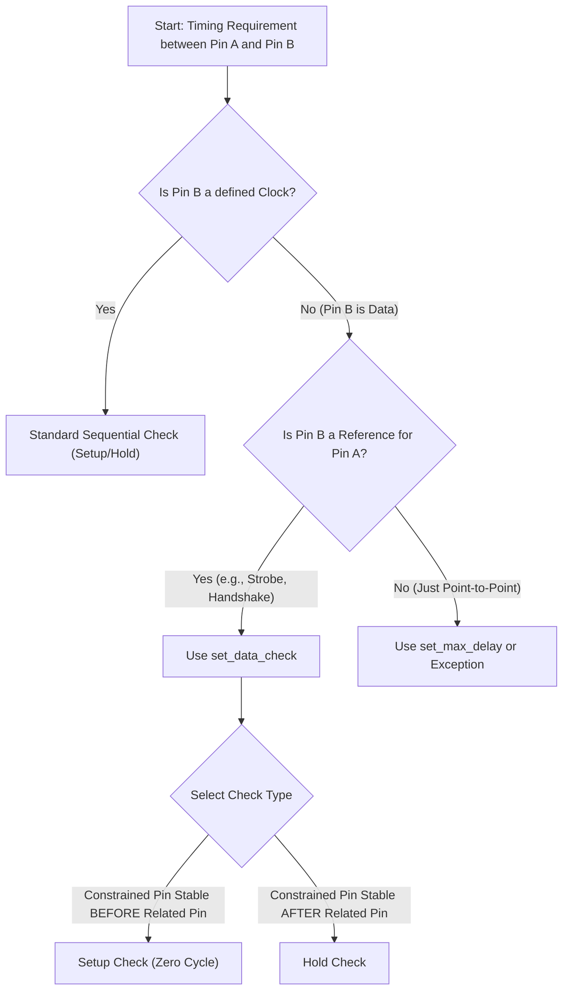

**One-Line Summary:** The `set_data_check` constraint defines timing relationships between two non-clock data signals, crucial for asynchronous interfaces, bus skew, or handshaking logic, operating as a zero-cycle setup/hold check.

## Purpose: Constraining Data-to-Data Timing Relationships

Standard setup and hold checks typically verify the timing relationship between a data signal and a synchronous clock signal. The `set_data_check` command is used when the timing dependency is between two non-clock data signals, where one acts as a reference for the other.

| Check Type | Description | Primary Use Cases |
| :--- | :--- | :--- |
| **Non-Sequential Check** (Library-based) | A library file or macro specifies the timing arc to be a non-sequential check, typically between two data pins of a cell. | Modeling timing relationships within complex macro cells or IP blocks where internal clock relationships are non-standard. |
| **`set_data_check`** (SDC command) | Explicitly defines a setup or hold constraint between any two arbitrary pins (data signals), overriding the default assumption that timing checks must involve a formal clock. | Constraining **handshaking interface logic**, **asynchronous** or self-timed circuits, skew between bus lines, or paths with unusual clock waveforms. |

### I. When `set_data_check` is Necessary

Standard synchronous checks use the clock's active edge to define launch and capture events. However, the clock reference is absent or inappropriate in several situations, necessitating the `set_data_check` constraint:

1.  **Asynchronous or Self-Timed Interfaces:** Commonly used in custom blocks with asynchronous interfaces. It checks the stability of one data signal (constrained pin) against the switching event of another data signal (related pin).
2.  **Bus Skew Constraints:** Used to check the maximum skew between bus lines (two data signals), ensuring all bits of a bus arrive or change within a specified time window relative to each other.
3.  **Unusual Waveforms:** Useful for signals with unusual clock waveforms that cannot be easily defined using `create_clock`.
4.  **Handshaking Logic:** Constrains timing on handshaking interface logic where control signals (request/acknowledge) must arrive or remain stable relative to data changes.
5.  **Asynchronous Pin Relationships:** Can be used to constrain recovery and removal timing requirements between asynchronous preset and clear input pins of sequential elements.

### II. Mechanism and Operation

The `set_data_check` command defines setup and hold windows relative to the non-clock *related pin*. Because these checks often concern relationships within a single operating cycle, their behavior differs from standard synchronous checks.

| Aspect | Description | Key Timing Rule |
| :--- | :--- | :--- |
| **Roles** | One pin is designated as the **constrained pin** (acts like the data input D of a flip-flop); the second pin is the **related pin** (acts like the clock input CK). | **`set_data_check` is a zero-cycle check (or same-cycle check)** by default, meaning both the launching event (on the constrained pin) and the reference event (on the related pin) are checked within the same clock cycle. |
| **Setup Check** | Ensures the constrained signal (data) arrives and is stable for a minimum time *before* the reference edge transitions on the related pin. | Mathematically analogous to a zero-cycle setup check. |
| **Hold Check** | Ensures the constrained signal (data) remains stable for a minimum time *after* the transition on the related pin. | Due to the zero-cycle setup rule, the default hold check is typically performed one clock cycle prior to the constrained pin's launch edge unless specified otherwise. |
| **Flexibility** | Allows for non-traditional constraints like **no-change data checks** (ensuring a signal remains stable during a pulse interval) by combining a setup check on the rising edge and a hold check on the falling edge. |

### III. Comparison to Library-Based Data Checks

While `set_data_check` is an explicit user constraint, design timing libraries (`.lib` files) can also contain **non-sequential constraints** (also known as library-based data checks).

| Feature | Library-Based Data Checks (Non-Sequential) | `set_data_check` Command (SDC) |
| :--- | :--- | :--- |
| **Source** | Implicitly performed if defined in the timing library for a cell. | Explicitly defined by the user in the SDC. |
| **Slew Sensitivity** | Often has setup/hold values that are sensitive to signal slew. | **Not sensitive to slew**; applies a fixed constraint value between arbitrary pins. |
| **Clock Conversion** | If the related pin is explicitly labeled as a clock in the library, the tool ignores the non-sequential constraint and converts it into a standard sequential clock check. | Applies between arbitrary data signals, not primarily clock-driven. |

### IV. Distinction from Standard Synchronous Checks

| Feature | Standard Setup/Hold Check | Non-Sequential `set_data_check` |
| :--- | :--- | :--- |
| **Timing Source** | Defined relative to an active clock edge of a sequential element (flip-flop/latch). | Defined relative to a data signal (non-clock) transition at any two arbitrary pins. |
| **Default Cycle** | **One clock cycle** (Launch edge N to Capture edge N+1). | **Zero cycle** (Launch event N to Reference event N). |

### Decision Flow: Using set_data_check

## Quiz

> [!QUESTION]
> **Question 1:** What does a 'non-sequential check', such as one defined by `set_data_check`, verify?
>
> **Correct Answer:** A timing constraint between two asynchronous data signals where one acts as a reference for the other.

> [!QUESTION]
> **Question 2:** When is a `set_data_check` constraint used instead of a standard setup/hold check defined by a clock?
>
> **Correct Answer:** To constrain the timing relationship between two data signals, such as in an asynchronous interface or to check skew between bus lines.

## References
*   **Source:** *Static Timing Analysis for Nanometer Designs* by Rakesh Chadha.
