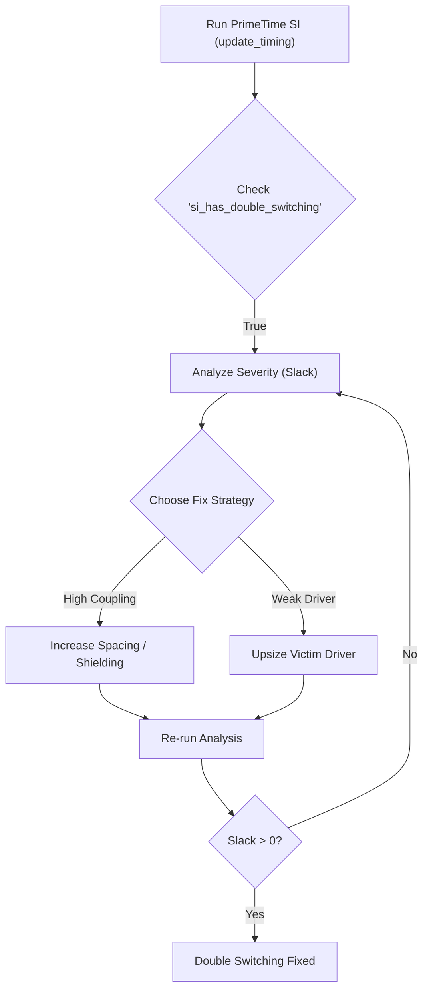

**One-Line Summary:** A detailed explanation of double-switching functional failures caused by crosstalk on switching victim nets, including detection, effects, and mitigation strategies.

## I. Double-Switching Definition and Cause

Double-switching errors are a specific type of functional failure resulting from crosstalk effects on a victim net that is already in the process of transitioning (a switching victim net).

**Definition:** A noise bump on a victim net that is large enough to cross the logic threshold of a receiving gate, causing it to momentarily switch its output state and then switch back.

| Aspect | Description |
| :--- | :--- |
| **Fundamental Cause** | **Crosstalk coupling capacitance** between a strong aggressor transition acting on a **sensitive switching victim net**. |
| **Mechanism** | An aggressor net transition induces a voltage bump in the **sensitive voltage area** at the input of the receiving gate. If this bump is sufficiently large, it causes the output of the buffer (or receiving cell) to momentarily switch its state and then switch back. |
| **Detection** | Double-switching errors are detected during the `update_timing` command in PrimeTime SI, which marks affected nets using attributes like `si_has_double_switching`. |

## II. Undesirable Effects of Double-Switching

The functional failure caused by double-switching can lead to incorrect circuit operation through several undesirable effects:

1.  **False Clocking:** A double-switching event in a clock network can cause false clocking on the inactive edge of a clock signal.
2.  **Double Clocking:** It can cause double clocking on the active edge of a clock signal.
3.  **Glitch Propagation:** The momentary switch/switch-back action can propagate a glitch through combinational logic.

These effects are particularly problematic when they occur on clock signals leading to **rising-edge-sensitive registers**.

## III. Relationship to Static Noise Analysis

Double-switching errors are often associated with the same conditions that cause **static noise errors** on steady-state nets (nets that are constant at logic 1 or logic 0).

*   **Static Noise Analysis** (using `update_noise`) typically detects functional errors caused by large noise bumps or glitches on a victim net that is intended to remain constant.
*   While most double-switching conditions are detected by static noise analysis, PrimeTime SI can detect cases where crosstalk effects are large enough to cause double-switching errors **even if they are not large enough to register as steady-state functional failures**.

## IV. Debugging and Fixing Double-Switching Violations

For each detected functional failure, PrimeTime SI measures its severity and reports it as **double-switching slack**. Nets with a higher risk are reported as having a more negative slack.

**Prerequisite:** Double-switching detection requires the use of a cell library with **CCS noise models** because the tool uses this model to propagate the coupled waveform and check for potential double-switching with SPICE-like accuracy.

### Fix Methods
1.  **Reducing Cross-Capacitance:** This can be done by **spacing or shielding adjacent wires**.
2.  **Adjusting Drive Strength:** This involves **enlarging the victim net driver** to reduce the transition time.

### Troubleshooting Flow

> [!QUESTION]
> **Scenario:** During a noise analysis in PrimeTime SI, the tool reports a 'double-switching' functional failure. What does this indicate?
>
> **Correct Answer:** "A noise bump on a victim net was large enough to cross the logic threshold of a receiving gate, causing it to momentarily switch its output state and then switch back."

## References
*   **Source:** *Static Timing Analysis for Nanometer Designs* by Rakesh Chadha.
*   **Related:** [[crosstalk_delay_vs_noise]], [[reducing_si_pessimism_with_exclusion]]
