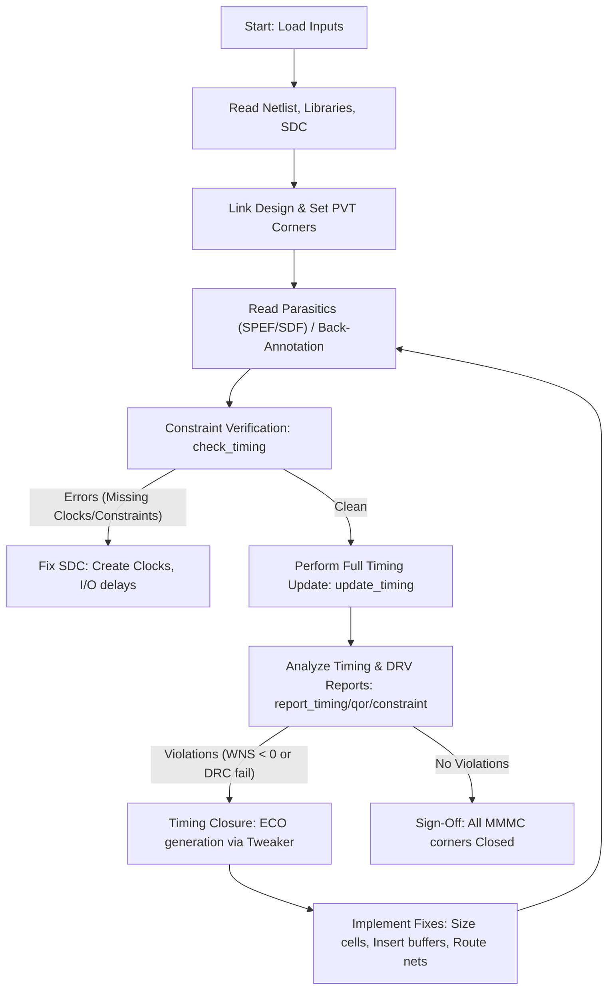

**One-Line Summary:** This note provides a dense, comprehensive overview of the Static Timing Analysis (STA) methodology necessary for successful sign-off in nanometer digital design, drawing entirely on the provided sources.

## Static Timing Analysis (STA) Sign-Off: A Comprehensive Guide

**Static Timing Analysis (STA)** is an exhaustive technique that verifies timing across all paths in a digital circuit by summing up gate and interconnect delays and comparing them against constraints [W1), 62]. STA provides a high level of timing coverage without requiring input stimulus vectors [W1), 64].

## I. Essential Inputs and Design Data

Successful STA execution relies on accurately modeling the design, the technology, and the constraints using industry-standard file formats [W1), 168].

### Table 1: Required STA Input Files and Information

| Input Component | Description | Formats/Content | Source/Purpose |
| :--- | :--- | :--- | :--- |
| **Netlist** | Describes the structural and logical connectivity of the design, including cells, pins, ports, and wires. | Verilog, VHDL. | Design under analysis (DUA). |
| **Timing Libraries** | Defines cell timing, functionality, PVT information, delay models, and Design Rule Constraints (DRVs). | **.lib** (Liberty), **.db** (proprietary database). | Provides cell delays and intrinsic requirements (setup/hold). |
| **Timing Constraints**| Specifies the operational environment, clock domains, and timing requirements. | **SDC** (Synopsys Design Constraints). | Includes: `create_clock`, `set_input_delay`, `set_output_delay`, and exceptions (`set_false_path`, `set_multicycle_path`). |
| **Parasitics Data** | Contains the interconnect Resistance (R), Capacitance (C), and coupling capacitance. | **SPEF** (Standard Parasitic Exchange Format). | Essential for accurate interconnect delay and crosstalk analysis. Extracted using tools like StarRC. |
| **Delay Format (Optional)** | Specifies cell delays, timing checks, and interconnect delays for back-annotation. | **SDF** (Standard Delay Format). | Used to communicate computed timing data, often for simulation back-annotation. |

## II. Core Static Timing Checks and Requirements

The primary function of STA is verifying path performance against sequential element requirements [W2), 61].

### Table 2: Critical Timing and Design Rule Checks

| Check Type | Requirement (Constraint) | Worst-Case Analysis Scenario | Optimization Strategy |
| :--- | :--- | :--- | :--- |
| **Setup Time** (Max Delay) | Data must be stable *before* the capture clock edge. Ensures data propagates quickly enough. | Analyzed in the **Worst-Case Slow (WCS)** corner (slow process, low V, high T). | **Upsize** cells (reduces resistance, decreases delay), **Pipelining**, use **LVT** cells. |
| **Hold Time** (Min Delay) | Data must be stable *after* the capture clock edge deactivates. Prevents data loss due to fast paths. | Analyzed in the **Best-Case Fast (BCF)** corner (fast process, high V, low T). | **Insert buffers/delay cells** (endpoint buffering), **Downsize** cells, use **HVT** cells. |
| **DRVs** (Design Rule Violations) | Checks electrical limits derived from the technology library. | Applicable across various corners. | Max Transition, Max Capacitance, Max Fanout limits. |
| **Special Checks** | Verifies functional safety features. | Recovery/Removal timing on resets, Clock gating checks, Min pulse width, and Latch Time Borrowing [W2)]. | Clock integrity must be guaranteed [W2)]. |

### Key Timing Path Calculation

The general timing relationship for a setup check (max delay) over one clock cycle:

**Max Margin/Slack** = [Capture Clock Arrival (Fastest) – Setup Time – Uncertainty] – [Launch Clock Arrival (Slowest) + Clock-to-Q Delay (Slowest) + Path Delay (Slowest)]

A path is failing if the margin/slack is negative. Setup and hold requirements depend on Input data slope, Clock slope, and Output load.

## III. Detailed STA Execution Flow (PrimeTime)

The STA process is executed sequentially, starting with loading the design and verifying constraints, followed by iterative analysis and timing closure.

### Flowchart: Static Timing Analysis Workflow

### Table 3: Essential Commands and Functionality

| Command | Category | Purpose and Detail |
| :--- | :--- | :--- |
| **`read_verilog`/`read_lib`** | Data Read | Loads the gate-level netlist and technology libraries. |
| **`check_timing`** | **Sanity/Validation**| **Crucial step** to verify constraint completeness. Checks for undefined clocking (`no_clock`), unconstrained endpoints, missing input delays, combinational loops (`loops`), and latch fanout. |
| **`set_case_analysis`** | Setup | Specifies constant values (e.g., TEST pin=0 in functional mode) to reduce irrelevant path analysis. |
| **`read_parasitics`** | Back-Annotation | Reads SPEF or DSPF/RSPF files to annotate detailed RC values from the physical layout. |
| **`update_timing`** | Analysis | Performs the full timing calculation (data arrival, required times, slack) across the design graph. |
| **`report_timing`** | Reporting | Displays detailed path information, including incremental delay, transition time, capacitance, and slack. Defaults to reporting the Worst Negative Slack (WNS) setup path. |
| **`report_qor`** | Reporting | Provides a high-level summary of timing health, including **WNS** and **TNS** (Total Negative Slack) across path groups. |
| **`report_constraint`** | Reporting | Checks and summarizes **DRV violations** (Max Tran, Max Cap, Max Fanout) and provides a summary of setup/hold violations by group. |
| **`report_analysis_coverage`** | Validation | Gauges the completeness of constraints by reporting the percentage of timing checks (setup, hold, DRC) that are tested, violated, or **untested** due to incomplete assertions or disabled paths. |
| **`size_cell`** | ECO Fix | Command used to upsize or downsize a cell to fix timing issues. |

## IV. Advanced Timing and Variation Analysis

Modern sign-off requires incorporating deep submicron effects, on-chip variation, and multivoltage scenarios.

### Table 4: Advanced Analysis Techniques

| Analysis Type | Description and Mechanism | Key Concepts |
| :--- | :--- | :--- |
| **MMMC Analysis** | **Multi-Mode Multi-Corner** analysis verifies the design across multiple operating modes (e.g., Functional, Scan Shift) and multiple combinations of PVT (Process, Voltage, Temperature) and parasitic interconnect corners. | Ensures that fixes in one scenario do not break timing in another. Scenarios can include WCS, BCF, WCL, and different RC corners (Min C, RCworst). |
| **On-Chip Variation (OCV)** | Models variation in device/interconnect characteristics on the same die due to manufacturing complexities (e.g., Vth, Le, IR drop). | **AOCV** (Advanced OCV) applies derates based on logic depth and physical distance. **POCV** (Parametric OCV) uses statistical variation data from LVF libraries. |
| **Statistical STA (SSTA)** | Models cell and interconnect delays statistically (mean and standard deviations) rather than relying only on absolute worst-case values. | Reduces pessimism compared to traditional worst-case analysis while accurately bounding the timing distribution. Statistical interconnect modeling allows different metal layers to vary independently. |
| **Signal Integrity (SI)** | Analyzes the impact of **crosstalk** (signal noise and delay) on timing paths. Requires coupling capacitance data from SPEF. | Crosstalk delay affects timing only if the **aggressor's switching window overlaps the victim's transition window** (Aggressor Victim Timing Correlation). |
| **Multivoltage (SMVA/DVFS)** | **Simultaneous Multivoltage Analysis (SMVA)** allows graph-based analysis to simultaneously consider combinations of supply voltages for all paths in a design. | Required for designs using **DVFS (Dynamic Voltage and Frequency Scaling)**. Requires defining voltage scaling library groups and PG connectivity. |

## V. STA Sign-Off Criteria

STA sign-off requires comprehensive validation to ensure the layout is robust and meets all performance and design goals. The APR engineer is responsible for delivering a layout with zero timing and physical violations.

### Sign-Off Mandates

*   **Zero Timing Violations:** The design must exhibit **Zero setup, hold, and slew violations** (WNS $\geq 0$) across all required MMMC scenarios. Hold violations must be eliminated first, as they are non-frequency dependent functional failures.
*   **Design Rule Closure (DRC):** Zero errors from **Max Transition, Max Capacitance, and Max Fanout** checks.
*   **Physical Verification Closure:** Zero errors from **LVS** (Layout Versus Schematic), **DRC** (Design Rule Check), and **DFM** (Design for Manufacturing) checks.
*   **Completeness and Integrity:** All constraints must be verified as complete and correct (`check_timing` passes clean). If crosstalk is analyzed, Signal Integrity closure must be met (e.g., zero reported SI bottlenecks).
*   **Final Verification:** Timing is often confirmed using **Exhaustive Path-Based Analysis (PBA)** on critical paths to eliminate graph-based pessimism and confirm true slack values.

## References
*   **Source:** *Static Timing Analysis for Nanometer Designs* by Rakesh Chadha.
*   **Related:**
    *   **Timing Models & Basics:** [[ccs_vs_nldm_timing_models]], [[elmore_RC_delay_model]], [[resistive_shielding_effect]], [[spef_net_models]]
    *   **Execution & Flow:** [[sta_execution_approaches]], [[mmmc_dmsa_smva_analysis]], [[essential_primetime_variables]], [[check_timing_vs_report_constraint]], [[set_case_analysis_purpose]]
    *   **Advanced Analysis:** [[graph_based_vs_path_based_analysis]], [[limitations_of_sta_vs_dynamic_simulation]], [[statistical_static_timing_analysis_ssta]], [[timing_derates_and_ocv]], [[set_driving_cell_command]]
    *   **Clock & Constraints:** [[clock_group_relationships]], [[active_high_clock_gating_check]], [[clock_gating_timing_checks]], [[set_data_check_non_sequential]], [[half_cycle_path_definition]], [[useful_skew_in_cts]], [[pll_modeling_for_timing_analysis]], [[ddr_dqs_90_degree_phase_shift]]
    *   **Checks & Violations:** [[hold_checks_at_slow_corners]], [[recovery_and_removal_checks]], [[time_borrowing_in_latches]], [[latch_inference_from_incomplete_case]], [[why_crpr_needed_for_setup_and_hold_both]]
    *   **Signal Integrity:** [[crosstalk_delay_vs_noise]], [[crosstalk_timing_correlation]], [[crosstalk_impact_in_glitch_and_delay]], [[reducing_si_pessimism_with_exclusion]], [[si_double_switching_failure]]
