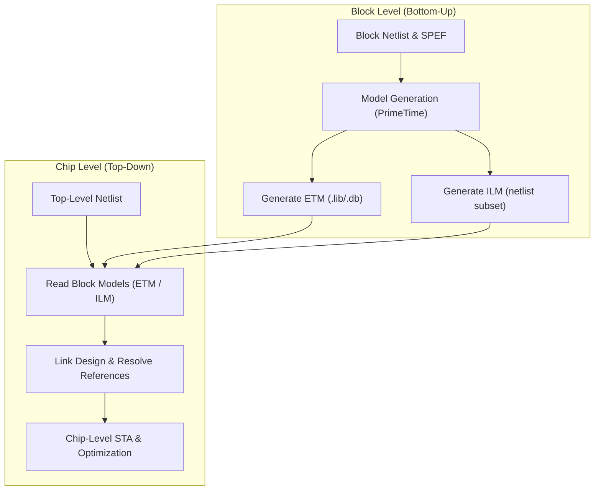
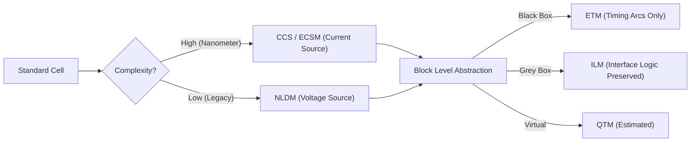

**One-Line Summary:** A detailed overview of various Static Timing Analysis (STA) execution methodologies, ranging from full flat analysis to hierarchical abstraction models (ETM, ILM) and advanced variability handling (AOCV, POCV).

> [!QUESTION]
> **Question:** Why might a design team use an Extracted Timing Model (ETM) for a block during chip-level STA instead of its full gate-level netlist?
>
> **Correct Answer:** To significantly reduce the memory and runtime of the top-level analysis while preserving accurate interface timing characteristics.

## I. Purpose and Definition of Extracted Timing Models (ETMs)

An **Extracted Timing Model (ETM)** is a core tool in modern hierarchical design flows designed specifically to handle the capacity and performance challenges of large chip-level verification. It abstracts the internal complexity of a large block, replacing the **full gate-level netlist** with a simplified timing-only model.

| Feature | Description |
| :--- | :--- |
| **Primary Goal** | **Significantly reduce memory and runtime** of top-level STA while preserving interface accuracy. Essential for multi-million gate designs. |
| **Definition** | **Compact black-box timing models** representing the timing behavior of the original circuit. Often distributed as `.lib` or `.db` files. |
| **Content** | Replaces internal logic with **context-independent timing arcs** between external pins. Hides internal implementation details (IP protection). |

### Benefits Over Full Gate-Level Netlist
1.  **Capacity & Runtime:** Drastically reduces the object count (gates/nets) for the top-level solver, preventing memory exhaustion and reducing analysis time from days to hours.
2.  **Accuracy Preservation:** Retains accurate interface timing (pin-to-pin delays, setup/hold, drive strength) required for boundary path verification.
3.  **IP Reuse:** Abstracts implementation details, facilitating safe IP exchange and integration.

## II. Hierarchy of Timing Models

STA relies on modular timing data, moving from basic cell characterization to high-level hierarchical abstractions.

### A. Foundational Delay Models (Cell Level)
These define the behavior of standard cells.
*   **Related:** [[ccs_vs_nldm_timing_models]]

| Model | Mechanism | Usage |
| :--- | :--- | :--- |
| **NLDM** | 2D Lookup Tables (Input Slew, Output Load). | Standard library characterization. Less accurate for nanometer nodes. |
| **CCS / ECSM** | **Time-varying current source** driver model + C1/C2 receiver model. | Advanced nodes (28nm+). Explicitly models non-linear effects and Miller effect. |
| **LDM** | Linear Equation ($D = D_0 + D_1 S + D_2 C$). | Historical/Quick estimation. Inaccurate for modern tech. |

### B. Hierarchical Abstraction Models (Block Level)

| Model Type | Abstraction Mechanism | Primary Usage |
| :--- | :--- | :--- |
| **ETM** | **Black-box**. Only pin-to-pin timing arcs (I/O delays). | **IP Reuse**, Top-Level integration where internal visibility is not needed. |
| **ILM** | **Interface Logic Model**. Preserves logic only for I/O boundary paths and clock trees. | **Chip-Level STA**. Offers higher accuracy for interface paths than ETMs while abstracting internal register-to-register paths. |
| **QTM** | **Quick Timing Model**. User-defined constraints and delays via scripts. | **Early Planning**. Used when the netlist is not yet available. |

### C. Variability Models (Advanced Timing)
*   **Related:** [[timing_derates_and_ocv]], [[statistical_static_timing_analysis_ssta]]

| Model | Mechanism | Purpose |
| :--- | :--- | :--- |
| **OCV** | Constant **derating factors** (e.g., -5% early, +5% late). | Conservative bounding of process variation. |
| **AOCV** | Derates based on **logic depth** and **physical distance**. | Reduces OCV pessimism. Uses table-based lookup. |
| **POCV / SSTA** | Models delay as **statistical distributions** ($\mu, \sigma$). | Sign-off for highly variable processes. Requires LVF libraries. |

## III. STA Execution Flows: Flat vs. Hierarchical

The choice of execution flow depends on the design phase and resource constraints.

### 1. Full Flat Analysis
*   **Components:** Full Netlist + Libraries + SPEF.
*   **Pros:** Highest accuracy (no abstraction).
*   **Cons:** Computationally expensive. May be impossible for full chips.
*   **Use Case:** Block-level sign-off or small designs.

### 2. Hierarchical Analysis (ETM/ILM)
*   **Components:** Top-level Netlist + Block Models (ETM/ILM).
*   **Pros:** Massive runtime/memory savings.
*   **Cons:** Requires model generation step. Internal block paths are not visible.
*   **Use Case:** Full-chip integration and sign-off.

### Flowchart: Hierarchical STA Methodology

### Flowchart: Timing Model Evolution

## IV. Dynamic Simulation & SDF
While STA is exhaustive for timing, **Dynamic Simulation** verifies functionality.
*   **SDF (Standard Delay Format):** Used to back-annotate STA-calculated delays into the simulation tool, replacing ideal zero-delay or estimated unit-delay models with actual timing data for "Gate-Level Simulation" (GLS).

## References
*   **Source:** *Static Timing Analysis for Nanometer Designs* by Rakesh Chadha.
*   **Related:** [[sta]], [[ccs_vs_nldm_timing_models]], [[timing_derates_and_ocv]], [[statistical_static_timing_analysis_ssta]]
