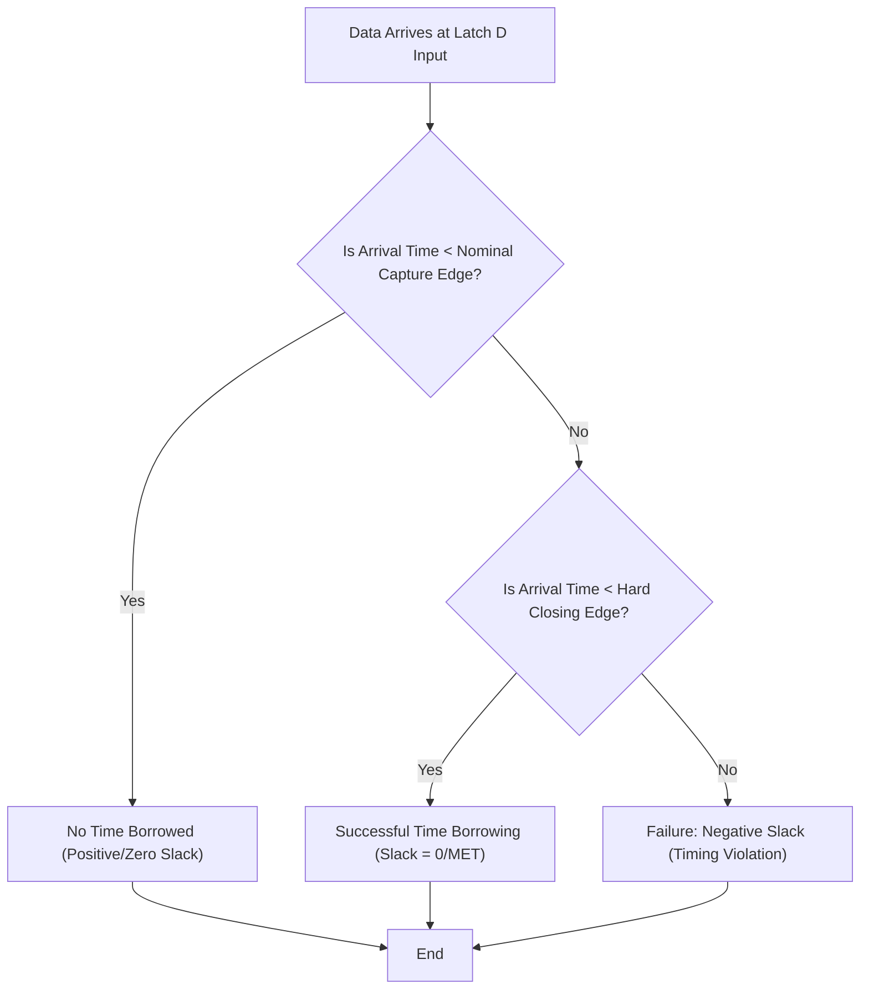

**One-Line Summary:** Explains how transparent latches can "borrow" time from a subsequent pipeline stage, clarifying the distinction between successful borrowing (zero slack) and timing violations (negative slack) even when time borrowing is reported.

## Introduction: Understanding Time Borrowing

Time borrowing (also called cycle stealing) is an intentional technique for exploiting the level-sensitive nature of latches to relax timing constraints between pipeline stages. It allows data to arrive at a latch after its nominal capture edge but still be successfully captured, effectively "borrowing" time from the next stage's clock cycle.

### I. Function of Time Borrowing

*   **Mechanism:** When a latch is transparent (its clock/gate signal is active), data arriving at the D pin immediately propagates to the output (Q).
*   **Borrowing Event:** Time borrowing occurs when the data signal arrives at the latch **after the nominal deadline** (the clock's ideal capture edge), but **before the latch's closing edge** (the end of the transparency window).
*   **Result:** The time overrun is "borrowed" from the subsequent path stage. If this process is successful, the timing path ending at the latch is typically reported as having **zero slack (MET)**, and the next path segment starts later ("time given to startpoint"), demonstrating that timing was met.

### II. Why an Incorrect Answer might be Incorrect (Contradiction)

An answer like "The data signal arrived after the latch's closing edge, but it arrived during the transparency window" contains a critical contradiction.
*   **Closing Edge:** The **latch's closing edge** represents the **hard, functional deadline** for data capture in that cycle.
*   **Timing Violation (Negative Slack):** If the data arrives **after the latch's closing edge**, the latch has become opaque, and it **cannot capture the data**, resulting in a clear functional timing **violation (negative slack)**.
*   **Logical Impossibility:** If the data arrives *after* the closing edge, it *cannot* have arrived *during* the transparency window. The presence of **negative slack** signifies that the attempt to meet timing (by arriving before the closing edge) **failed**.

### III. Significance of Negative Slack with Non-Zero Time Borrowed

The condition presented in the quiz question ("negative slack but also a non-zero value for 'time borrowed'") indicates that the path **violated** timing (negative slack) despite the **attempt** to borrow time. The non-zero "time borrowed" value reported in this failure scenario reflects the internal tool calculation of the **maximum amount of time the path attempted to borrow** before the final closing edge was missed.

### IV. Level-Sensitive Latch Operation and Timing Deadlines

Unlike edge-triggered flip-flops that sample data instantaneously on a clock edge, a transparent latch samples data throughout its **transparency window** (when the clock/enable signal is active).
In synchronous design using latches, setup checks are performed against two deadlines to determine timing closure and whether time borrowing has occurred:

| Deadline | Description | Purpose in Setup Check |
| :--- | :--- | :--- |
| **Nominal Capture Edge** | The ideal time the data is required to arrive, derived from the active edge of the subsequent latch's clock (e.g., the opening edge of the next stage). | This is the *default* calculation point. If data arrives after this time, **time borrowing begins**. |
| **Hard Closing Edge** | The **end of the latch's transparency window** (when the clock/enable signal transitions to the inactive state). | This is the absolute latest moment the data can arrive and still be successfully captured. **Arriving after this point results in a violation (negative slack)**. |

The time borrowing mechanism essentially exploits the difference between these two deadlines.

### V. Mechanism of Time Borrowing (Success vs. Failure)

Time borrowing is the mechanism by which a path exceeding the nominal deadline can "steal" time from the succeeding stage's available clock cycle time.

1.  **Successful Borrowing (Zero or Positive Slack):** If the data arrives *after* the nominal capture edge but *before* the hard closing edge, the latch successfully captures the data. The tool adjusts the required time of the current path forward to match the arrival time, setting the **slack to zero (MET)**. Simultaneously, the tool updates the required arrival time of the *next* sequential path (starting at the latch's Q output) backward by the amount of time borrowed (the "time given to startpoint").

2.  **Failure Despite Potential Borrowing (Negative Slack):** If the data arrival time exceeds the hard closing edge (the physical boundary of the transparency window), a setup **violation** occurs, resulting in **negative slack**.

### VI. Visualizing the Setup Window

| Latch Event | Time on Timeline (Conceptual) | Slack Outcome |
| :--- | :--- | :--- |
| Clock Launch Edge | $T_{launch}$ (Launch clock path delay) | Start of calculation for data launch path |
| Nominal Capture Edge | $T_{launch} + T_{period}$ | Data must arrive before this time to avoid borrowing. |
| Hard Closing Edge | $T_{latch\_close}$ | **Hard Deadline.** If $T_{arrival} > T_{latch\_close}$, violation (Negative Slack). |

*Analogy:* Think of the nominal capture edge as the time you are *scheduled* to finish a project phase (Time 1). The hard closing edge is the *absolute final minute* before the delivery office closes (Time 2). If you finish between Time 1 and Time 2, you successfully borrow time but must still deliver the project before Time 2. If the data arrives after Time 2, the project delivery fails (negative slack), even though the attempt to gain time between Time 1 and Time 2 still occurred (non-zero 'time borrowed' calculation).

### Flow Diagram: Time Borrowing in Latches

## Quiz

> [!QUESTION]
> **Question:** A timing report for a path ending at a transparent latch shows a negative slack but also a non-zero value for 'time borrowed'. What does this signify?
>
> **Correct Answer:** The data signal arrived after the clock's ideal capture edge but before the end of the latch's transparency window, effectively passing timing by using slack from the next stage. (When paired with negative slack, it means the *attempt* to borrow failed to meet the hard closing edge.)

## References
*   **Source:** *Static Timing Analysis for Nanometer Designs* by Rakesh Chadha.
