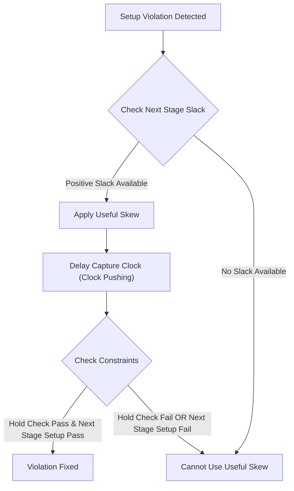

**One-Line Summary:** An explanation of useful skew as a Clock Tree Optimization (CTO) technique to fix setup violations by intentionally delaying the capture clock, effectively borrowing time from subsequent stages.

## I. The Concept of Useful Skew

Clock skew is defined as the difference in timing (delays of clock paths) between two sequential cells. Historically, the goal of Clock Tree Synthesis (CTS) is to minimize clock skew, aiming for zero skew ideally.

However, **useful skew** is an optimization technique where clock skew is **intentionally introduced** to address timing failures.

| Goal of Action | Mechanism | Effect on Clock Edges |
| :--- | :--- | :--- |
| **Fix Setup Violations** (Clock Pushing) | Delay the clock arrival at the **capture flip-flop** relative to the launch flip-flop. | Moves the required capture edge further out in time, increasing the time available for data propagation. |
| **Fix Hold Violations** (Clock Pulling) | Shorten the clock path to the **launch flip-flop**, or delay the clock arrival at the capture flop. | If applied to the launch clock, the data is launched earlier, which helps satisfy the required minimum hold time relative to the capture edge.|

When a path fails setup (the data arrives too late), delaying the capture clock effectively **"borrows" time** from the next path stage. This manipulation assumes that the subsequent path (the one starting at the now-delayed capture flip-flop) has enough positive slack to spare.

## II. Implementation and Terminology

The process of implementing useful skew by adjusting the clock path delays is also known as **clock pushing** (delaying the clock) and **clock pulling** (speeding up the clock).

In the context of fixing setup violations, the following mathematical relationship shows the impact of skew:

$$ 
\text{Data Path Delay} < \text{Clock Period} + (\mathbf{T}_{\text{capture}} - \mathbf{T}_{\text{launch}}) - \text{T}_{\text{setup}} 
$$

The term $(\mathbf{T}_{\text{capture}} - \mathbf{T}_{\text{launch}})$ represents the clock skew.

*   If the **capture clock delay ($\mathbf{T}_{\text{capture}}$) is intentionally increased** (positive skew), the maximum path delay allowed increases, helping to fix a setup violation. This is **positive skew** and is generally good for setup.
*   If the **launch clock delay ($\mathbf{T}_{\text{launch}}$) is intentionally decreased** (making it shorter than the capture clock), the difference becomes more positive, also aiding setup fixing.

For hold checking, the relationship is different: positive skew (delayed capture clock) is **bad for hold** because it increases the required time window the data must be stable after the clock edge. Therefore, fixing a setup violation using positive skew must be carefully balanced to ensure no new hold violations are created on the current path, or critical setup violations are introduced on subsequent paths.

## III. Useful Skew and CTS

CTS is the physical design step that connects clock pins of all sequential elements to the clock network using buffers and inverters. While the main goal of CTS is minimizing clock skew and insertion delay, modern CTS tools implement useful skew strategies (also known as Clock Tree Optimization or CTO) to meet the tight timing goals set during the design phase.

If the design already has timing violations, using useful skew is a powerful method to resolve them before moving to later stages like routing.

To perform this optimization:

*   The timing tool identifies the violating paths and the slack needed.
*   The tool calculates the necessary skew (delaying the clock to the capture flop) that would move the required data time just enough to meet the arrival time.
*   The physical implementation tool then builds the clock tree using buffers and wiring to achieve this calculated, non-zero skew.

This process is a necessary trade-off: fixing the critical path's setup time by borrowing slack, often at the cost of consuming the positive slack available on the succeeding data path.

### Useful Skew Decision Flow

> [!QUESTION]
> **Scenario:** What is the purpose of a 'useful skew' strategy in clock tree synthesis (CTS)?
> 
> **Correct Answer:** "To intentionally introduce clock skew by delaying the clock to capture flops on critical paths, thereby 'borrowing' time from the next stage to fix setup violations."

## References
*   **Source:** *Static Timing Analysis for Nanometer Designs* by Rakesh Chadha.
